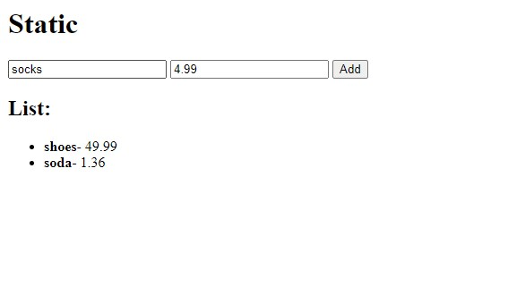

# My Own Static Project

## Table of contents

- [Overview](#overview)
  - [The challenge](#the-challenge)
  - [Screenshot](#screenshot)
  - [Links](#links)
- [My process](#my-process)

  - [Built with](#built-with)
  - [Instuctions](#instuctions)
  - [What I learned](#what-i-learned)
  - [Continued development](#continued-development)

- [Author](#author)
- [Acknowledgments](#acknowledgments)

## Overview

### The challenge

Users should be able to:

- Enter item name and price
- After pressing `Add`, item will be added to the list

### Screenshot



### Links

- Solution URL: [Add solution URL here](https://your-solution-url.com)
- Live Site URL: [Add live site URL here](https://your-live-site-url.com)

## My process

### Built with

- Semantic HTML5 markup
- JavaScript - Scripting language
- [Node.js](https://nodejs.org/)

### Instructions

#### 1. Setup a Node.js Project

1. **Install Node.js**: If you haven't already, download and install [Node.js](https://nodejs.org/).

2. **Create a Project Directory**:

```bash
mkdir my-node-project
cd my-node-project
```

3. **Initialize the Project**:

```bash
npm init -y
```

This will create a `package.json` file with default settings.

4. **Install Express**: Express is a fast, unopinionated, minimalist web framework for Node.js.

```bash
npm install express
```

#### 2. Setup a Server to Serve Static Files

1. **Create a Directory for Static Files**:

```bash
mkdir public
```

2. **Create an HTML File**:
   Place an `index.html` file in the `public` directory with some sample content:

```html
<!-- public/index.html -->
<!DOCTYPE html>
<html>
  <head>
    <title>My Static Site</title>
  </head>
  <body>
    <h1>Hello, World!</h1>
  </body>
</html>
```

3. **Create the Server File**:
   Create a file named `server.js` in the root of your project directory:

```javascript

// server.js
const express = require('express');
const path = require('path');

const app = express();
const port = 3000;

// Serve static files from the "public" directory
app.use(express.static(path.join(\_\_dirname, 'public')));

// Start the server
app.listen(port, () => {
console.log(`Server is running on http://localhost:${port}`);
});
```

4. **Run the Server**:

```bash
node server.js
```

5. **Access the Server**:
   Open your browser and navigate to `http://localhost:3000`. You should see your "Hello, World!" message from the `index.html` file.

#### Summary of Project Structure

Your project structure should look like this:

```java

my-node-project/
├── node_modules/
├── public/
│ └── index.html
├── package.json
├── package-lock.json
└── server.js
```

### What I learned

Learned how to setup a static server

### Continued development

I am going to turn this into a React App next.

## Author

- Website - [Cameron Howze](https://camkol.github.io/)
- Frontend Mentor - [@camkol](https://www.frontendmentor.io/profile/camkol)
- GitHub- [@camkol](https://github.com/camkol)
- LinkedIn - [@cameron-howze](https://www.linkedin.com/in/cameron-howze-28a646109/)
- E-Mail - [cameronhowze4@outlook.com](mailto:cameronhowze4@outlook.com)

## Acknowledgments

My friend Daniel to push me to learn it.
